# Ejercicios

Para superar el módulo debéis entregar como mínimo:

* La parte obligatoria de los ejercicios de Jenkins o GitLab.
* La parte obligatoria de los ejercicios de GitHub Actions.
* Uno de los dos ejercicios opcionales de la parte de GitHub Actions

## Ejercicios Jenkins

### 1. CI/CD de una Java + Gradle - OBLIGATORIO

En el directorio raíz de este [código fuente](./jenkins-resources), crea un `Jenkinsfile` que contenga una pipeline declarativa con los siguientes stages:

* **Checkout**. Descarga de código desde un repositorio remoto, preferentemente utiliza GitHub
* **Compile**. Compilar el código fuente utilizando `gradlew compileJava`
* **Unit Tests**. Ejecutar los test unitarios utilizando `gradlew test`

Para ejecutar Jenkins en local y tener las dependencias necesarias disponibles podemos contruir una imagen a partir de [este Dockerfile](./jenkins-resources/gradle.Dockerfile)

### Solución
#### Checkout. Descarga de código desde un repositorio remoto, preferentemente utiliza GitHub

* He creado el repositorio https://github.com/dmpinero/ejercicios_jenkins
* He clonado el repositorio ejercicios_jenkins creado en el punto anterio en local, a través de la terminal:
    ```bash
    git clone https://github.com/dmpinero/ejercicios_jenkins
    ```
* He copiado la carpeta jenkins-resources (ubicada en https://github.com/Lemoncode/bootcamp-devops-lemoncode/tree/master/03-cd/exercises/jenkins-resources) en el repositorio clonado
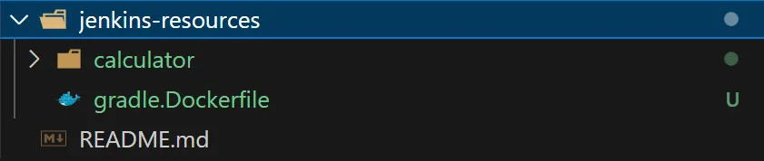

* He creado el archivo Jenkinsfile dentro de la carpeta ejercicios-jenkins
* 

* Para ejecutar Jenkins en local y tener las dependencias necesarias disponibles podemos construir una imagen a partir de este Dockerfile ubicado en https://github.com/Lemoncode/bootcamp-devops-lemoncode/blob/master/03-cd/exercises/jenkins-resources/gradle.Dockerfile

* Ubicados en la carpeta jenkins_resources, ejecutamos el siguiente comando para construir la imagen:
    ```bash
    docker build -t gradle-app:1.0 -f gradle.Dockerfile .
    docker run -p 8080:8080 --name gradle-app-container gradle-app:1.0
    ```
    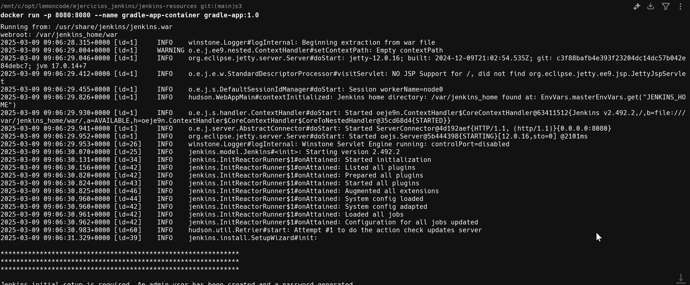

* Al entrar por primera vez he configurado el usuario y contraseña de Jenkins, y he instalado los plugins necesarios
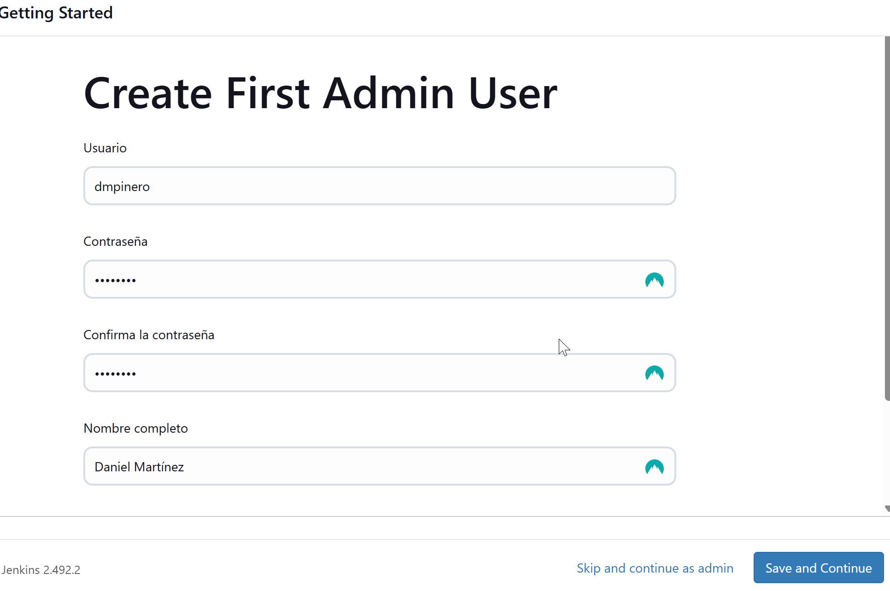

* He creado el stage de **Checkout** en el archivo Jenkinsfile con el siguiente código:
    ```groovy
        pipeline {
        agent any

        stages {
            stage('Checkout') { // Checkout. Descarga de código desde un repositorio remoto
                steps {
                    // Limpia el workspace antes de descargar
                    cleanWs()
                    
                    // Descarga el código desde el repositorio de GitHub
                    git branch: 'main',
                        url: 'https://github.com/dmpinero/ejercicios_jenkins'
                }
            }
        }
    }
    ```
* He creado la tarea en Jenkins
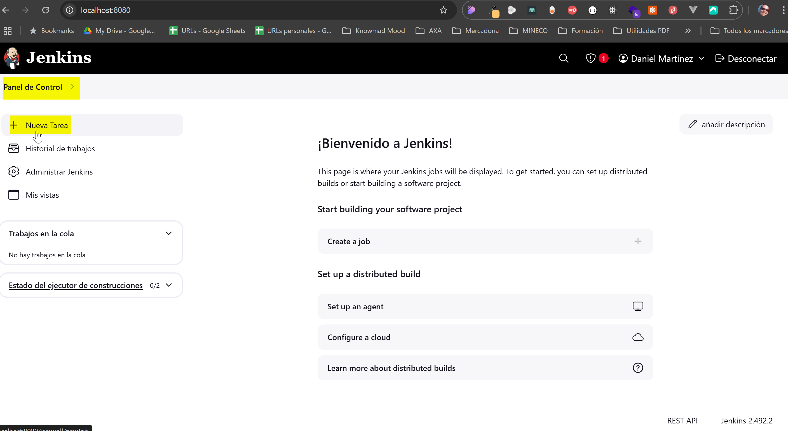

* He subido el código al repositorio de GitHub
    ```bash
    git add .
    git commit -m "Añadido stage Checkout"
    git push origin main
    ```

* Para la ejecución del Pipeline he realizado los siguientes pasos:
    * He creado una nueva tarea con nombre **ejercicios-jenkins** y de tipo Pipeline
    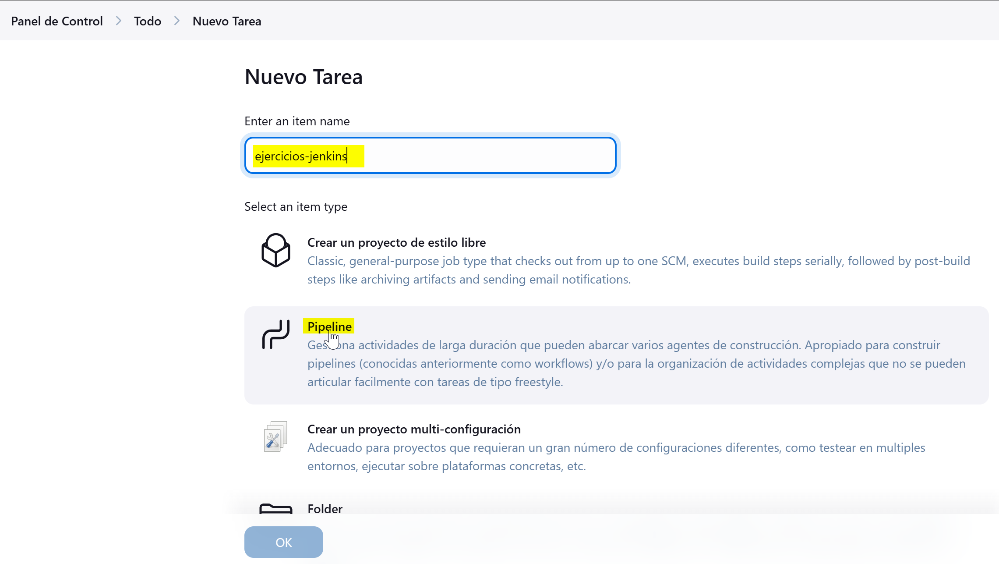

    * He configurado el pipeline
    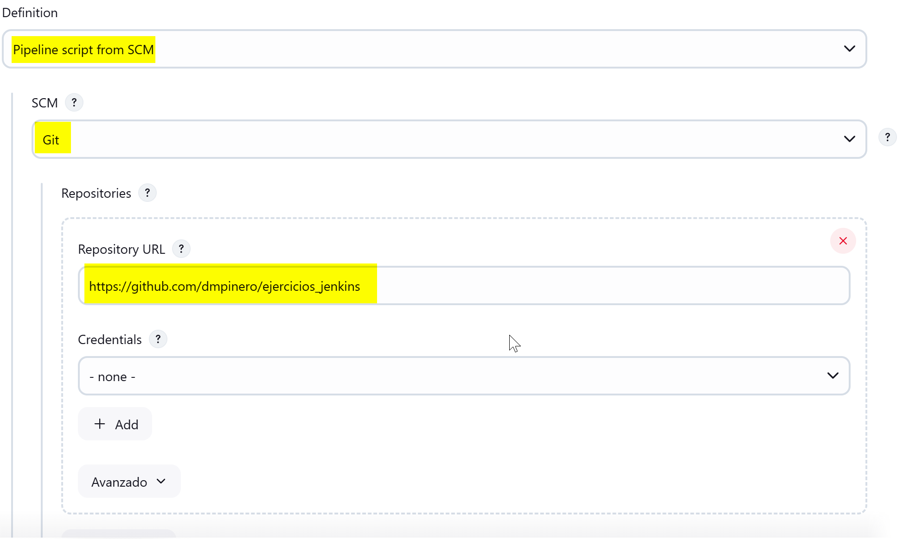
    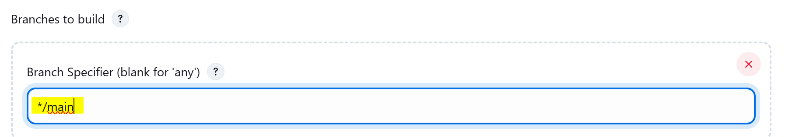
    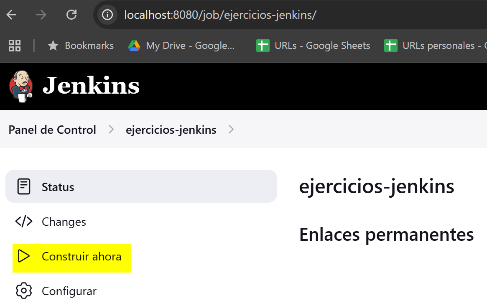

* He verificado que el proceso de checkout es correcto
    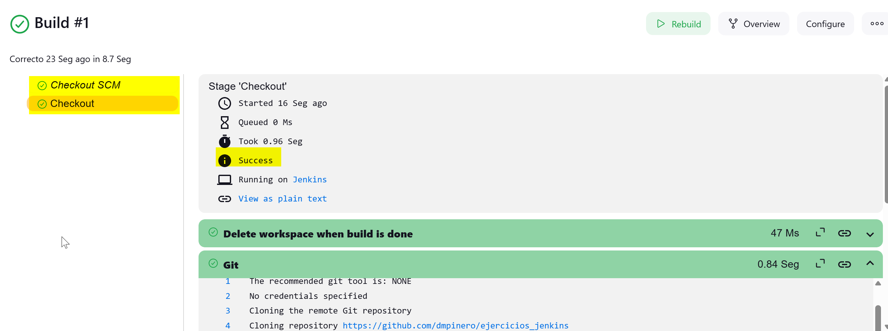

#### Compile. Compilar el código fuente utilizando `gradlew compileJava`
* He creado el stage de **Compile** en el archivo Jenkinsfile con el siguiente código:
    ```groovy
        pipeline {
            agent any

            tools {
                jdk 'JDK17'
            }

            stages {
                stage('Checkout') {
                    steps {
                        // Limpia el workspace antes de descargar
                        cleanWs()
                        
                        // Descarga el código desde el repositorio específico
                        git branch: 'main',
                            url: 'https://github.com/dmpinero/ejercicios_jenkins'
                    }
                }

                stage('Set Permissions') {
                    steps {
                        sh '''
                            echo "=== Setting Gradle Wrapper Permissions ==="
                            chmod +x jenkins-resources/calculator/gradlew
                        '''
                    }
                }

                stage('Update Gradle') {
                    steps {
                        dir('jenkins-resources/calculator') {
                            // Crear directorio si no existe
                            sh 'mkdir -p gradle/wrapper'
                            
                            // Descargar los archivos necesarios del wrapper
                            sh '''
                                wget -O gradle/wrapper/gradle-wrapper.jar https://github.com/gradle/gradle/raw/v7.6.0/gradle/wrapper/gradle-wrapper.jar
                                
                                echo "distributionBase=GRADLE_USER_HOME
        distributionPath=wrapper/dists
        distributionUrl=https\\://services.gradle.org/distributions/gradle-7.6-bin.zip
        zipStoreBase=GRADLE_USER_HOME
        zipStorePath=wrapper/dists" > gradle/wrapper/gradle-wrapper.properties
                            '''
                        }
                    }
                }

                stage('Check Environment') {
                    steps {
                        sh 'java -version'
                        dir('jenkins-resources/calculator') {
                            sh './gradlew --version'
                        }
                    }
                }
                
                stage('Compile') {
                    steps {
                        dir('jenkins-resources/calculator') {
                            // Compilar el código fuente usando el JDK configurado en tools
                            sh './gradlew clean compileJava --info'
                        }
                    }
                }
            }
        } 
    ```
* Durante la ejecución de la pipeline se ha obtenido el error General error during semantic analysis: Unsupported class file major version 61. Al final de ensayo/error se consigue solucionar
    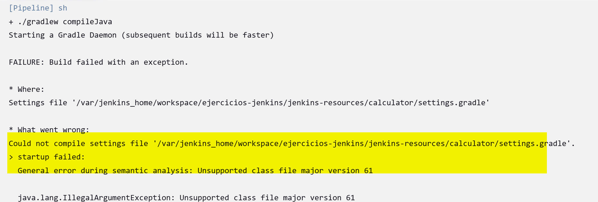
  
* He Verificado que el proceso de construcción (build) es correcto
    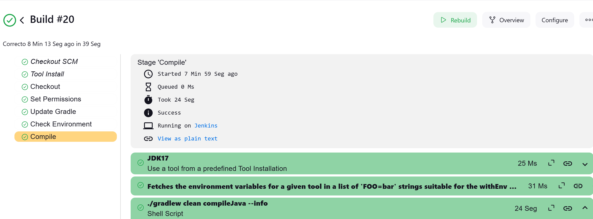


### 2. Modificar la pipeline para que utilice la imagen Docker de Gradle como build runner - OBLIGATORIO

* Utilizar Docker in Docker a la hora de levantar Jenkins para realizar este ejercicio
* Como plugins deben estar instalados `Docker` y `Docker Pipeline`
* Usar la imagen de Docker `gradle:6.6.1-jre14-openj9`

### Solución
* He creado archivo Dockerfile en la carpeta ejercicios-jenkins con el siguiente contenido:
    ```dockerfile
    FROM jenkins/jenkins:lts

    USER root

    # Install prerequisites
    RUN apt-get update && \
        apt-get install -y \
        ca-certificates \
        curl \
        gnupg

    # Add Docker's official GPG key
    RUN install -m 0755 -d /etc/apt/keyrings && \
        curl -fsSL https://download.docker.com/linux/debian/gpg | gpg --dearmor -o /etc/apt/keyrings/docker.gpg && \
        chmod a+r /etc/apt/keyrings/docker.gpg

    # Add the repository to Apt sources
    RUN echo \
        "deb [arch="$(dpkg --print-architecture)" signed-by=/etc/apt/keyrings/docker.gpg] https://download.docker.com/linux/debian \
        "$(. /etc/os-release && echo "$VERSION_CODENAME")" stable" | \
        tee /etc/apt/sources.list.d/docker.list > /dev/null

    # Install Docker
    RUN apt-get update && \
        apt-get install -y \
        docker-ce \
        docker-ce-cli \
        containerd.io \
        docker-buildx-plugin \
        docker-compose-plugin

    # Install Jenkins plugins
    RUN jenkins-plugin-cli --plugins \
        docker-workflow \
        docker-plugin \
        gradle

    USER jenkins
    ```

* He creado archivo docker-compose.yml en la carpeta ejercicios-jenkins con el siguiente contenido:
    ``````groovy
    services:
        jenkins:
            build: .
            privileged: true
            user: root
            ports:
            - "8081:8080"
            - "50000:50000"
            volumes:
            - jenkins_home:/var/jenkins_home
            - /var/run/docker.sock:/var/run/docker.sock
            environment:
            - DOCKER_HOST=unix:///var/run/docker.sock

        volumes:
        jenkins_home: {}
    ```
* He creado archivo Jenkinsfile  en la carpeta ejercicios-jenkins con el siguiente contenido:
    ```groovy
        pipeline {
            agent {
                docker { 
                    image 'gradle:6.6.1-jre14-openj9'
                    args '-v $HOME/.gradle:/home/gradle/.gradle'
                }
            }

            stages {
                stage('Checkout') {
                    steps {
                        // Limpia el workspace antes de descargar
                        cleanWs()
                        
                        // Descarga el código desde el repositorio específico
                        git branch: 'main',
                            url: 'https://github.com/dmpinero/ejercicios_jenkins'
                    }
                }

                stage('Check Environment') {
                    steps {
                        sh '''
                            echo "=== Java Version ==="
                            java -version
                            echo "\n=== Gradle Version ==="
                            gradle --version
                        '''
                    }
                }
                
                stage('Compile') {
                    steps {
                        dir('jenkins-resources/calculator') {
                            // Compilar el código fuente usando el JDK configurado en tools
                            sh 'gradle clean compileJava --info'
                        }
                    }
                }
            }
        }
    ```
* He modificado el archivo el archivo build.gradle en la carpeta ejercicios-jenkins/jenkins-resources/calculator con el siguiente contenido:
    ```groovy
        plugins {
            id 'java'
            id 'org.springframework.boot' version '2.4.13'
            id 'io.spring.dependency-management' version '1.0.11.RELEASE'
        }

        group = 'com.lemoncode'
        version = '0.0.1-SNAPSHOT'

        java {
            sourceCompatibility = JavaVersion.VERSION_14
            targetCompatibility = JavaVersion.VERSION_14
        }

        repositories {
            mavenCentral()
        }

        dependencies {
            // implementation 'org.springframework.boot:spring-boot-starter'
            implementation 'org.springframework.boot:spring-boot-starter-web'

            testImplementation 'org.springframework.boot:spring-boot-starter-test'
            // testImplementation('org.springframework.boot:spring-boot-starter-test') {
            // 	exclude group: 'org.junit.vintage', module: 'junit-vintage-engine'
            // }
        }

        test {
            useJUnitPlatform()
        }
    ```
* Ubicados en la carpeta ejercicios-jenkins he construido y levantado los contenedores
    ```bash
    docker-compose up -d --build
    ```
    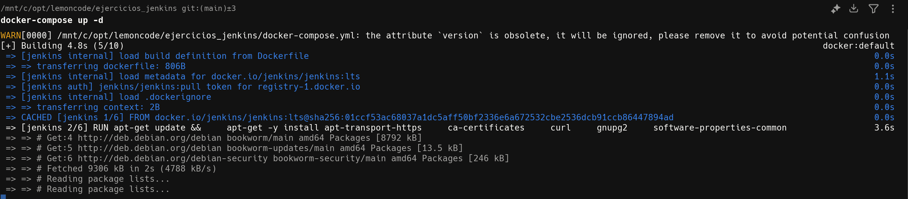

* Obtener la constraseña inicial de jenkins
    ```bash
    docker-compose exec jenkins cat /var/jenkins_home/secrets/initialAdminPassword
    ```

* Arrancar Jenkins, introduciendo la contraseña obtenida en el paso anterior
    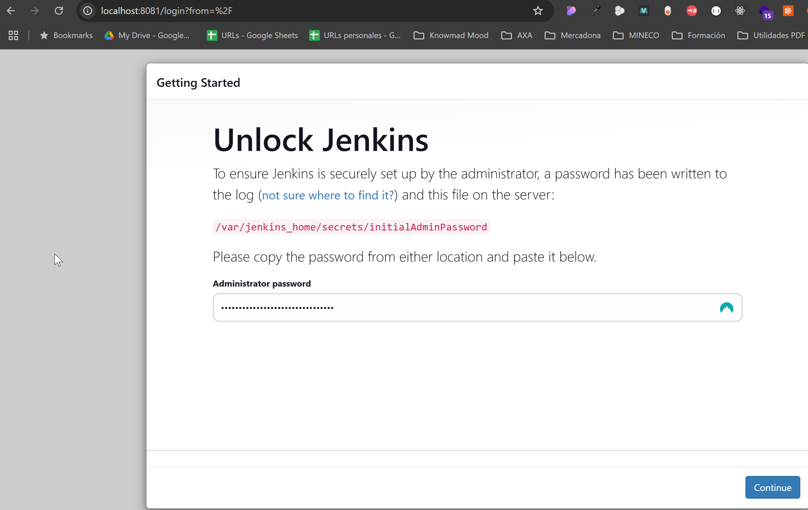

* Instalar plugins sugeridos

* Crear nuevo usuario
    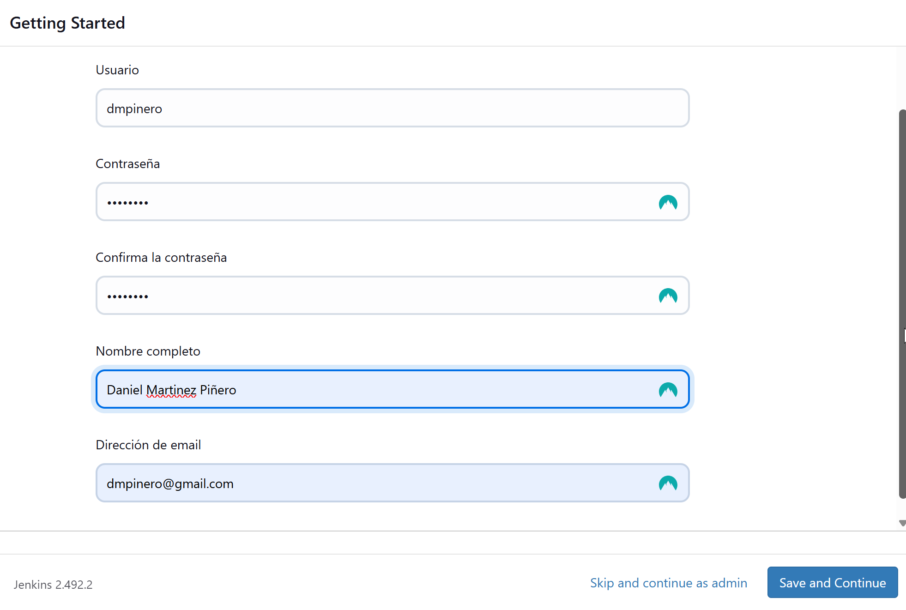

* Acceder a Jenkins y crear nueva tarea de tipo Pipeline con nombre build-runner
    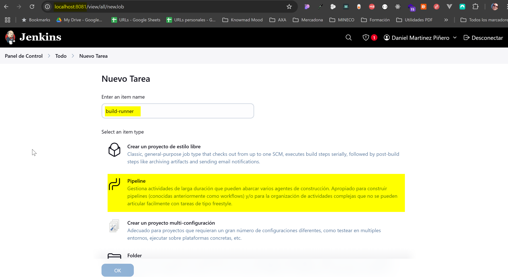

* Configurar el pipeline
    

* Ejecutar el pipeline build-runner y verificar que la ejecución es correcta
    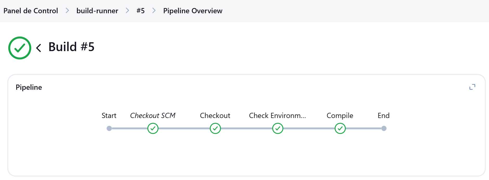
    
    