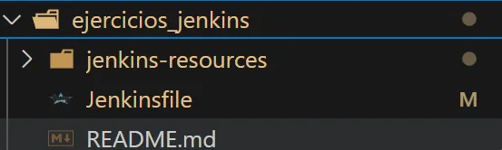

# Ejercicios

Para superar el módulo debéis entregar como mínimo:

* La parte obligatoria de los ejercicios de Jenkins o GitLab.
* La parte obligatoria de los ejercicios de GitHub Actions.
* Uno de los dos ejercicios opcionales de la parte de GitHub Actions

## Ejercicios Jenkins

### 1. CI/CD de una Java + Gradle - OBLIGATORIO

En el directorio raíz de este [código fuente](./jenkins-resources), crea un `Jenkinsfile` que contenga una pipeline declarativa con los siguientes stages:

* **Checkout**. Descarga de código desde un repositorio remoto, preferentemente utiliza GitHub
* **Compile**. Compilar el código fuente utilizando `gradlew compileJava`
* **Unit Tests**. Ejecutar los test unitarios utilizando `gradlew test`

Para ejecutar Jenkins en local y tener las dependencias necesarias disponibles podemos contruir una imagen a partir de [este Dockerfile](./jenkins-resources/gradle.Dockerfile)

### Solución

* He creado el repositorio https://github.com/dmpinero/ejercicios_jenkins
* He clonado el repositorio ejercicios_jenkins creado en el punto anterio en local, a través de la terminal:
    ```bash
    git clone https://github.com/dmpinero/ejercicios_jenkins
    ```
* He copiado la carpeta jenkins-resources (ubicada en https://github.com/Lemoncode/bootcamp-devops-lemoncode/tree/master/03-cd/exercises/jenkins-resources) en el repositorio clonado


* He creado el archivo Jenkinsfile dentro de la carpeta ejercicios-jenkins
* 

* Para ejecutar Jenkins en local y tener las dependencias necesarias disponibles podemos construir una imagen a partir de este Dockerfile ubicado en https://github.com/Lemoncode/bootcamp-devops-lemoncode/blob/master/03-cd/exercises/jenkins-resources/gradle.Dockerfile

* Ubicados en la carpeta jenkins_resources, ejecutamos el siguiente comando para construir la imagen:
    ```bash
    docker build -t gradle-app:1.0 -f gradle.Dockerfile .
    docker run -p 8080:8080 --name gradle-app-container gradle-app:1.0
    ```
    

* Al entrar por primera vez he configurado el usuario y contraseña de Jenkins, y he instalado los plugins necesarios


* He creado el stage de **Checkout** en el archivo Jenkinsfile con el siguiente código:
    ```groovy
        pipeline {
        agent any

        stages {
            stage('Checkout') { // Checkout. Descarga de código desde un repositorio remoto
                steps {
                    // Limpia el workspace antes de descargar
                    cleanWs()
                    
                    // Descarga el código desde el repositorio de GitHub
                    git branch: 'main',
                        url: 'https://github.com/dmpinero/ejercicios_jenkins'
                }
            }
        }
    }
    ```
* He creado la tarea en Jenkins


* He subido el código al repositorio de GitHub
    ```bash
    git add .
    git commit -m "Añadido stage Checkout"
    git push origin main
    ```

* Para la ejecución del Pipeline he realizado los siguientes pasos:
    * He creado una nueva tarea con nombre **ejercicios-jenkins** y de tipo Pipeline
    

    * He configurado el pipeline
    
    
    

* He verificado que el proceso de checkout es correcto
    


### 2. Modificar la pipeline para que utilice la imagen Docker de Gradle como build runner - OBLIGATORIO

* Utilizar Docker in Docker a la hora de levantar Jenkins para realizar este ejercicio
* Como plugins deben estar instalados `Docker` y `Docker Pipeline`
* Usar la imagen de Docker `gradle:6.6.1-jre14-openj9`